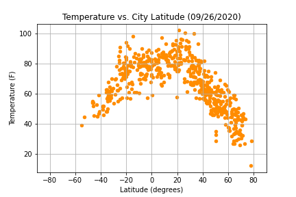
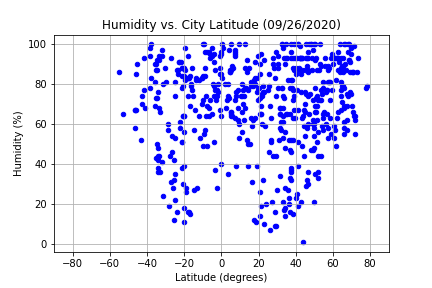
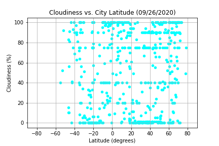
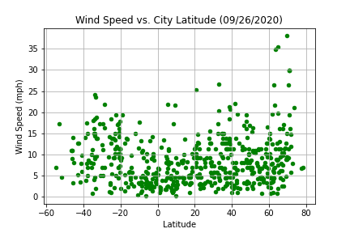
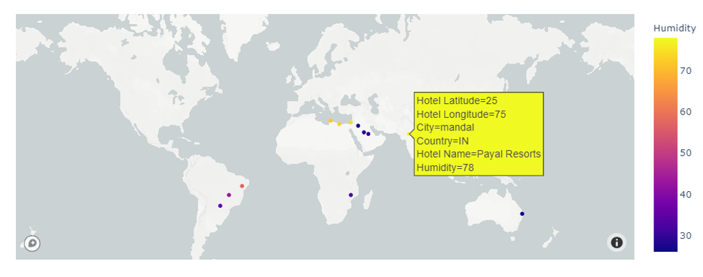

# Python API Challenge

## WeatherPy
This script helps to visualize the weather of 500+ randomly chosen cities from across the world of varying distance from the equator using the Open Weather Map API. It checks if weather (including temperature, humidity, cloudiness, and wind speed) is correlated to latitude.

## VacationPy
Using the cities located in WeatherPy, this script aims to find locations amongst them that have ideal weather conditions for vacationers (as defined), and then finds hotel recommendations using the Google Places API.

## General Info

### Data Set
Note: Any user running this code must use their own API keys in order to successfully make the API calls (api_keys.py template file provided).
* Python library, CityPy (https://pypi.python.org/pypi/citipy)
* OpenWeatherMap API (https://openweathermap.org/api)
* Google Places API
    
### Technologies
The languages, libraries and other tools used in this project are as below:

* Python     - version 3.7.8
* Pandas     - version 20.1.1
* Matplotlib - version 3.3.0
* Citipy     - version 0.0.5
* NumPy      - version 1.18.5
* SciPy      - version 1.5.1
* Plotly     - version 4.10.0
* Mapbox
* Time       
* Datetime
* Jupyter Notebook
    
### Actions and Tasks
* Data Cleaning and Exploration
* Data Analysis and Visualization
* Writing Analysis and Conclusions

## Analysis & Conclusions

### WeatherPy - Observable Trends
* Temperature shows a strong positive correlation with latitude in both hemispheres.
* Humidity, cloudiness, and wind speed show almost no correlation with latitudes in both hemispheres.
* Even randomly chosen city locations are biased, and are dominantly from the Northern Hemisphere, where majority of the Earth's landmass is concentrated, as we know. The Northern Hemisphere also has more inhabited areas and weather stations at higher latitudes as compared to the Southern Hemisphere.

### VacationPy - Output
- Output map below shows hotel recommendations for cities (12 in the case considered) that would have ideal weather for vacationers (as defined), color coded by humidity levels at each location

     
## Contact
Created by [@iCode13](https://github.com/iCode13) - please contact with questions/comments.
